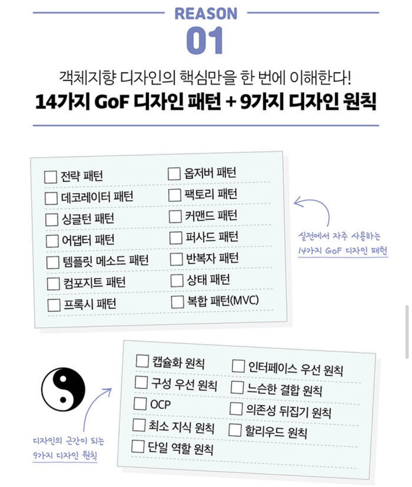

# ⚡️ Design-Pattern_Study

- 혼자서 디자인패턴을 공부하기보다는 같이 생각을 공유하는 **스터디**  
- 디자인 패턴 (referenced book: 헤드 퍼스트 디자인 패턴(개정판))

- 객체지향의 기본과 원칙 공부
- 14가지의 GOF디자인 패턴 공부

## 🔎 진행 과정 (03/01~)
- 매주 하나의 디자인패턴에 대해 공부 후 **5줄**로 요약
- 간단한 **SourceCode** 첨부로 이해도 증가

## 💡 진행 내역
- [ ] 전략패턴
